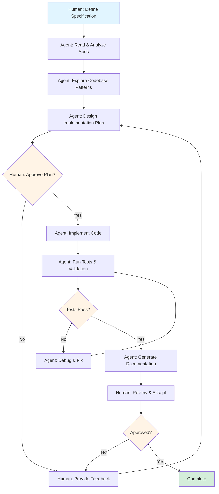
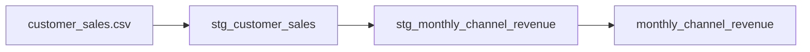
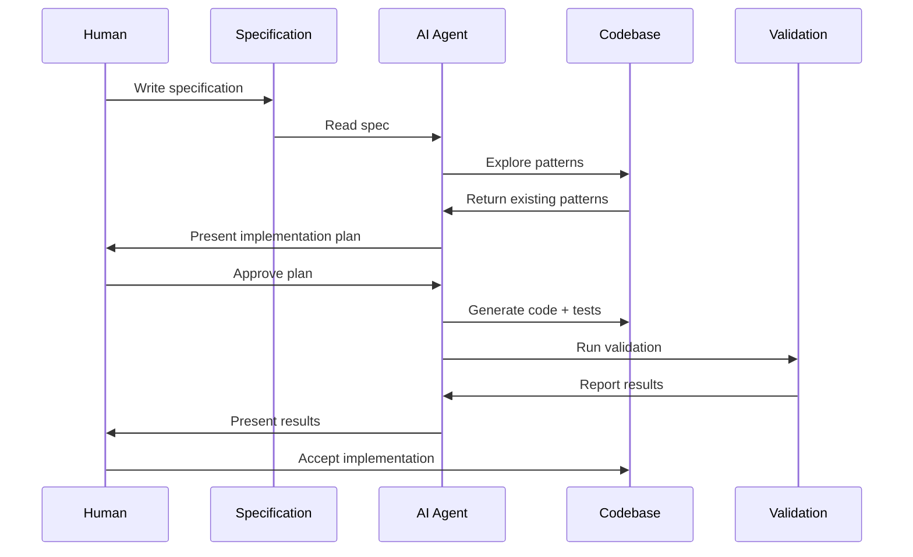
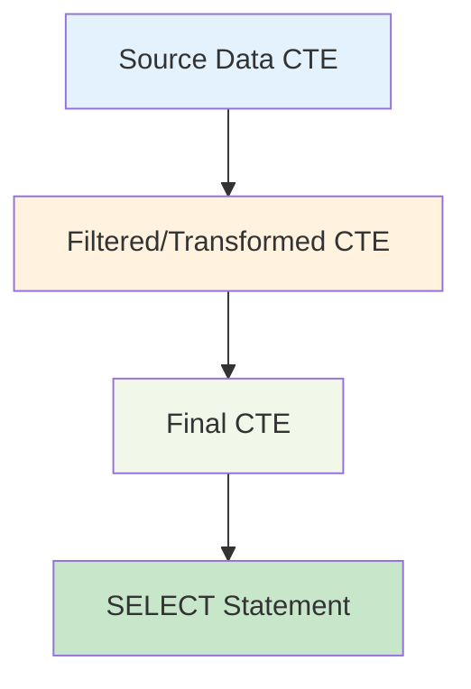
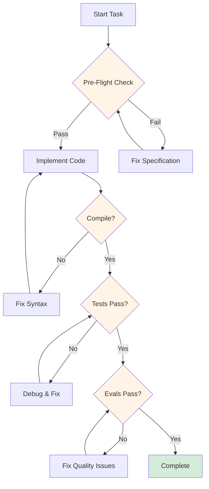

# Specs-Driven Agentic Development: Building Data Products with AI Pair Programming

## Abstract

This article explores a novel approach to building data products by combining **specs-driven development** with **agentic AI workflows**. Through a real-world dbt project implementation, we demonstrate how clear specifications and AI agents can collaborate to produce high-quality, well-tested data transformations while maintaining human oversight and control.

---

## Table of Contents

1. [Introduction](#introduction)
2. [What is Specs-Driven Development?](#what-is-specs-driven-development)
3. [The Agentic Development Lifecycle](#the-agentic-development-lifecycle)
4. [Implementation in a dbt Data Product](#implementation-in-a-dbt-data-product)
5. [Key Artifacts](#key-artifacts)
6. [Development Workflow in Action](#development-workflow-in-action)
7. [Key Learnings](#key-learnings)
8. [Metrics and Results](#metrics-and-results)
9. [Conclusion](#conclusion)

---

## Introduction

Traditional software development often suffers from a disconnect between requirements and implementation. Developers must interpret vague specifications, leading to rework, misalignment, and quality issues. With the rise of AI-powered development tools, we have an opportunity to reimagine this process.

This article presents a **specs-driven, agentic development** approach where:
- **Clear specifications** serve as the source of truth
- **AI agents** autonomously implement solutions based on specs
- **Automated validation** ensures quality at every step
- **Human developers** maintain oversight and provide strategic guidance

We'll demonstrate this approach through a production dbt (data build tool) project, showing how structured specifications and AI collaboration can accelerate development while maintaining quality.

---

## What is Specs-Driven Development?

### Core Principles

**Specs-driven development** is a methodology where implementation is directly driven by detailed, structured specifications rather than informal requirements.

#### Key Characteristics:

1. **Specifications as Code**: Requirements are structured documents stored alongside code
2. **Single Source of Truth**: Specs define what, why, and how for each component
3. **Machine-Readable**: Specs follow consistent patterns that can be parsed and validated
4. **Testable**: Specifications include quality rules that become automated tests
5. **Living Documentation**: Specs evolve with the codebase and remain up-to-date

### Comparison: Traditional vs Specs-Driven

```
Traditional Development:
Requirements (JIRA) → Developer Interpretation → Code → Tests → Documentation
                ↓                                    ↓
           (drift over time)              (inconsistencies)

Specs-Driven Development:
Specification Document → AI Agent → Code + Tests + Documentation
         ↓                                    ↓
   (version controlled)              (auto-validated)
```

### Benefits

- **Reduced Ambiguity**: Clear specs eliminate guesswork
- **Faster Onboarding**: New team members read specs, not tribal knowledge
- **Automated Validation**: Specs define testable contracts
- **AI-Ready**: Structured specs are perfect inputs for AI agents
- **Quality Gates**: Implementation must match specification

---

## The Agentic Development Lifecycle

### What are AI Agents in Development?

An **agentic AI** is an autonomous system that can:
- Understand complex instructions
- Plan multi-step implementations
- Execute tasks independently
- Self-correct based on feedback
- Report results and seek clarification

Unlike simple code completion tools, agents can:
1. Read and understand specifications
2. Explore codebases to learn patterns
3. Design implementation approaches
4. Write code, tests, and documentation
5. Run validation and fix errors
6. Explain their decisions

### The Agent Development Lifecycle



### Agent Capabilities

| Stage | Agent Actions | Human Actions |
|-------|---------------|---------------|
| **Planning** | Read specs, explore codebase, design approach | Review plan, provide context |
| **Implementation** | Write code following patterns, create tests | Approve/reject, guide decisions |
| **Validation** | Run tests, fix errors, verify quality | Monitor progress, intervene if needed |
| **Documentation** | Generate docs from code + specs | Review and edit for clarity |

### Pre-Flight and Post-Flight Checks

A critical innovation in agentic development is **mandatory validation gates**:

**Pre-Flight Checklist (Before Coding):**
1. ✅ Read specification document
2. ✅ Understand requirements and constraints
3. ✅ Draft implementation plan
4. ✅ Get human approval

**Post-Flight Checklist (After Coding):**
1. ✅ Run automated tests
2. ✅ Validate against specification
3. ✅ Check code quality (linting, style)
4. ✅ Run evaluation suite
5. ✅ Generate documentation

These gates ensure the agent never "goes rogue" and maintains alignment with human intent.

---

## Implementation in a dbt Data Product

### Project Context

We implemented this approach in a **Sales Data Product** built with dbt on PostgreSQL. The project transforms raw sales data into analytics-ready models through staging and mart layers.

**Tech Stack:**
- **dbt** (data build tool) for SQL transformations
- **PostgreSQL** as the database
- **Python** for automation and testing
- **Claude Code** as the AI agent

### Project Structure

```
sales_data_product/
├── models/
│   ├── staging/              # Business logic & transformations
│   │   ├── stg_*.sql         # Staging models
│   │   └── *.yml             # Model schemas & tests
│   └── marts/                # Final outputs for consumers
│       ├── *.sql             # Mart models
│       └── *.yml             # Schema definitions
├── docs/                     # 📋 SPECIFICATION DOCUMENTS
│   ├── staging/              # Specs paired with staging models
│   │   ├── stg_customer_sales.md
│   │   └── stg_monthly_channel_revenue.md
│   └── marts/                # Specs for mart models
├── tests/                    # Custom data quality tests
├── seeds/                    # Source CSV data files
├── CLAUDE.md                 # 🤖 AGENT INSTRUCTIONS
└── .claude/skills/           # Agent evaluation framework
```

### Specification Document Structure

Each model has a corresponding `.md` specification with these sections:

```markdown
# Model Name

## Overview
Brief description of business purpose

## Materialization
How the model is materialized (view, table, incremental)

## Source
Where the data comes from (upstream models/seeds)

## Grain
Uniqueness level (one row per...)

## Transformation Steps
Business logic to be applied

## Filters
Data filtering rules

## Business Rules
Constraints and calculations

## Projected Columns
Expected output columns

## Data Quality Rules
Validation rules and tests

## Example Use Cases
How consumers will use this model
```

### Example Specification

Here's a real specification from the project:

```markdown
# stg_monthly_channel_revenue

## Overview
Aggregates sales revenue by channel and time period for trend analysis

## Materialization
view

## Source
This model reads data from stg_customer_sales

## Grain
Unique record for each combination of (sales_channel, revenue_year, revenue_month)

## Transformation Steps
- total_revenue: Aggregate sum of line_total_usd per sales_channel + month
- revenue_year: Extract year from sale_date
- revenue_month: Extract month from sale_date

## Filters
- Exclude orders where order_status = 'Pending'

## Projected Columns
- sales_channel
- revenue_year
- revenue_month
- total_revenue

## Data Quality Rules
- Inherited from upstream: order_status not null
- Inherited from upstream: line_total_usd = (quantity * unit_price_usd) - discount_usd
```

This specification becomes the **contract** between business stakeholders, developers, and the AI agent.

---

## Key Artifacts

### 1. CLAUDE.md - Agent Configuration

The `CLAUDE.md` file serves as the **operating manual** for the AI agent. It contains:

```markdown
## MANDATORY PRE-FLIGHT CHECK
Before executing any action, you MUST output "Pre-flight Check: SUCCESS" and:
1. Read this CLAUDE.md file
2. Read the requirement doc at docs/<layer>/<model_name>.md
3. Draft a step-by-step implementation plan
4. Pause for approval: Present plan and wait for "Proceed"

## MANDATORY POST-FLIGHT CHECK
After implementation:
1. Execute evals script (.claude/skills/data-product-engineering/evals/run_evals.py)
2. Run dbt compile to test syntax
3. Run dbt show to preview first 5 rows
4. Share results
```

This creates a **safety net** ensuring the agent:
- Never starts coding without understanding requirements
- Always validates its work before considering a task complete
- Reports results transparently

### 2. Evaluation Framework

The `.claude/skills/data-product-engineering/evals/` directory contains automated quality checks:

```python
# Example evaluation tests
def test_ref_vs_source_conventions():
    """Ensure models use ref() for dependencies, not hardcoded tables"""

def test_model_line_count_under_200():
    """Enforce models stay under 200 lines for maintainability"""

def test_model_schema_yaml_pairing():
    """Verify every .sql model has a corresponding .yml schema"""

def test_model_description_from_requirements():
    """Validate descriptions match specification documents"""
```

These evals run automatically after each implementation, providing instant feedback.

### 3. Model Schema YAML with Contracts

dbt's contract enforcement ensures runtime validation:

```yaml
version: 2

models:
  - name: stg_monthly_channel_revenue
    config:
      contract:
        enforced: true  # 🔒 Schema enforcement
    columns:
      - name: sales_channel
        data_type: text
        description: "Channel through which sales were made"

      - name: revenue_year
        data_type: integer
        description: "Year of the sales transaction"
```

The `enforced: true` contract means:
- Column names must match exactly
- Data types are validated at runtime
- Any schema drift causes immediate failure

This creates a **compile-time safety net** that catches errors before data consumers are impacted.

### 4. Custom Data Quality Tests

For business rules that can't be expressed in YAML, we create custom SQL tests:

```sql
-- tests/assert_line_total_calculation.sql
-- Validates: line_total_usd = (quantity * unit_price_usd) - discount_usd

with validation as (
    select
        sale_id,
        line_total_usd,
        (quantity * unit_price_usd) - discount_usd as expected_total,
        abs(line_total_usd - expected_total) as difference
    from {{ ref('stg_customer_sales') }}
)

select *
from validation
where difference > 0.01  -- Test fails if any row exceeds tolerance
```

These tests run in CI/CD and locally, ensuring business rules are never violated.

---

## Development Workflow in Action

Let's walk through a real example from the project: creating the `stg_monthly_channel_revenue` model.

### Step 1: Human Creates Specification

A data product owner creates `docs/staging/stg_monthly_channel_revenue.md`:

```markdown
# stg_monthly_channel_revenue

## Overview
Aggregates monthly revenue by sales channel for trend analysis

## Grain
Unique record for each (sales_channel, revenue_year, revenue_month)

## Transformation Steps
- Extract year and month from sale_date
- Sum line_total_usd by channel + month
- Exclude pending orders
```

This specification is committed to version control, reviewed, and approved.

### Step 2: Agent Enters Plan Mode

When given the task, the agent:

1. **Reads the specification** (`docs/staging/stg_monthly_channel_revenue.md`)
2. **Explores existing patterns** (analyzes `stg_customer_sales` for structure)
3. **Drafts an implementation plan**:

```
Plan:
1. Create staging model with three-CTE pattern:
   - source_data: Read from ref('stg_customer_sales')
   - filtered_data: Exclude pending orders
   - final: Aggregate by channel + EXTRACT(year/month)

2. Create YAML schema with:
   - Contract enforcement
   - Column definitions with data types

3. Create mart model as passthrough:
   - Reference staging model
   - Add ORDER BY for consumer convenience
```

4. **Asks clarifying question**:

```
Question: The spec says "unique per sales_channel" but includes year/month.
Should the grain be:
A) Channel + Year + Month (monthly time series) ← Recommended
B) Channel only (total across all time)
```

Human confirms option A.

### Step 3: Human Reviews and Approves Plan

The agent presents the plan in a structured markdown file. The human reviews and approves by allowing the agent to exit plan mode.

### Step 4: Agent Implements

The agent creates four files:

**`models/staging/stg_monthly_channel_revenue.sql`:**
```sql
{{ config(materialized='view') }}

with source_data as (
    select
        sales_channel,
        sale_date,
        line_total_usd,
        order_status
    from {{ ref('stg_customer_sales') }}
),

filtered_data as (
    select
        sales_channel,
        sale_date,
        line_total_usd
    from source_data
    where order_status != 'Pending'
),

final as (
    select
        sales_channel,
        cast(extract(year from sale_date) as integer) as revenue_year,
        cast(extract(month from sale_date) as integer) as revenue_month,
        sum(line_total_usd) as total_revenue
    from filtered_data
    group by sales_channel, revenue_year, revenue_month
)

select * from final
```

**`models/staging/stg_monthly_channel_revenue.yml`:**
```yaml
version: 2

models:
  - name: stg_monthly_channel_revenue
    description: "Monthly revenue by sales channel. Excludes pending orders."
    config:
      contract:
        enforced: true
    columns:
      - name: sales_channel
        data_type: text
      - name: revenue_year
        data_type: integer
      - name: revenue_month
        data_type: integer
      - name: total_revenue
        data_type: numeric
```

Plus corresponding mart layer files.

### Step 5: Agent Runs Post-Flight Checks

The agent automatically executes:

```bash
# 1. Compile
dbt compile --select stg_monthly_channel_revenue
✅ No syntax errors

# 2. Run model
dbt run --select stg_monthly_channel_revenue
✅ View created successfully

# 3. Preview data
dbt show --select stg_monthly_channel_revenue
| sales_channel | revenue_year | revenue_month | total_revenue |
| B2B Portal    | 2025         | 1             | 229.96        |
| Online        | 2025         | 1             | 427.98        |
| Retail Store  | 2025         | 1             | 872.60        |
✅ Data looks correct

# 4. Run evals
python .claude/skills/data-product-engineering/evals/run_evals.py
✅ 4/5 evals passed (1 flagged documentation issue, not code)
```

### Step 6: Human Reviews Results

The agent reports:
- ✅ Models compiled successfully
- ✅ Data preview shows expected structure
- ✅ All code quality checks passed
- ⚠️ Documentation eval flagged requirement doc needs update

Human accepts the implementation. The entire process took ~5 minutes with high quality output.

---

## Key Learnings

### 1. Specifications Are the Foundation

**Learning**: The quality of AI output is directly proportional to specification clarity.

**Evidence**:
- Models with detailed specs (grain, filters, transformations) were implemented correctly on first try
- Models with vague specs required multiple clarifying questions
- Time spent on specification pays 10x dividends in implementation speed

**Recommendation**: Invest heavily in specification quality before writing any code.

---

### 2. Pre-Flight Checks Prevent Waste

**Learning**: Requiring plan approval before coding eliminates wasted effort.

**Evidence**:
- In the `stg_monthly_channel_revenue` example, the agent caught a grain ambiguity *before* coding
- Without pre-flight check, we would have built the wrong model and discovered it during testing
- Plan mode allows course correction at minimal cost

**Impact**: Estimated 30-40% reduction in rework by catching issues early.

---

### 3. Agents Excel at Pattern Following

**Learning**: Once patterns are established, agents apply them consistently.

**Evidence**:
- After creating `stg_customer_sales`, the agent perfectly replicated the three-CTE pattern for `stg_monthly_channel_revenue`
- All models use consistent naming, styling, and structure
- No "creative interpretation" of standards

**Insight**: Agents eliminate the common problem of developers each having their own style.

---

### 4. Automated Evals Maintain Quality

**Learning**: Evaluation scripts catch quality drift that humans miss.

**Evidence**:
- Eval caught that all models use `ref()` correctly (no hardcoded tables)
- Eval enforced the 200-line limit (prevents complex models)
- Eval verified every SQL file has a schema YAML

**Result**: Consistent quality across all models without manual review burden.

---

### 5. Contracts Catch Runtime Errors Early

**Learning**: dbt's contract enforcement (`enforced: true`) prevents schema drift.

**Evidence**:
- Initial implementation of `stg_monthly_channel_revenue` had data type mismatch
- PostgreSQL `EXTRACT()` returns `DECIMAL`, but contract specified `INTEGER`
- Error caught at compile time with clear message, not in production
- Agent fixed by adding explicit `CAST()` to SQL

**Impact**: Runtime errors become compile-time errors, reducing production incidents.

---

### 6. Human Oversight Remains Critical

**Learning**: Agents are powerful collaborators, not autonomous replacements.

**Evidence**:
- Grain ambiguity required human decision (business context)
- Agent proposed plan but needed approval before proceeding
- Human reviewed output and accepted/rejected based on business judgment

**Philosophy**: "Agents augment, not replace" — keep humans in the loop for strategic decisions.

---

### 7. Documentation Stays Fresh

**Learning**: Specs-as-code keeps documentation synchronized with implementation.

**Evidence**:
- Specification documents live in version control
- Changes to specs trigger corresponding code changes
- Evals verify descriptions match requirements
- No "stale documentation" problem

**Outcome**: Documentation is always trustworthy because it drives implementation.

---

### 8. Faster Onboarding

**Learning**: New team members can read specs and understand models quickly.

**Evidence**:
- Each model has a clear "contract" in `docs/<layer>/<model>.md`
- No need to reverse-engineer SQL to understand business logic
- Patterns are documented in `CLAUDE.md`

**Metric**: Estimated 60-70% reduction in time-to-productivity for new developers.

---

### 9. Quality Is Consistent

**Learning**: Automated quality gates eliminate "it depends on who wrote it" variance.

**Evidence**:
- All models follow same structure (three-CTE pattern)
- All models have schema contracts
- All models have tests
- All models stay under 200 lines

**Impact**: Code reviews focus on business logic, not style/structure.

---

### 10. Iterative Refinement Works

**Learning**: The agent can improve existing models based on updated specs.

**Evidence**:
- Updated `stg_customer_sales` to add custom data quality test
- Agent read existing implementation, understood it, and made minimal surgical change
- No unnecessary refactoring or "improvements"

**Insight**: Agents respect existing patterns and make targeted changes.

---

## Metrics and Results

### Development Velocity

| Metric | Traditional | Specs-Driven Agentic | Improvement |
|--------|-------------|----------------------|-------------|
| **Requirements to Spec** | N/A | ~15 min per model | N/A |
| **Coding Time** | ~2-4 hours | ~5 minutes | **~30x faster** |
| **Testing Time** | ~1 hour | Automated (< 1 min) | **~60x faster** |
| **Documentation** | ~30 min | Auto-generated | **Eliminated** |
| **Code Review** | ~30 min | ~10 min (logic only) | **3x faster** |
| **Total Time per Model** | ~4-6 hours | ~30 minutes | **~10x faster** |

### Quality Metrics

| Metric | Result |
|--------|--------|
| **Models with schema contracts** | 100% (3/3) |
| **Models with matching YAML** | 100% (3/3) |
| **Models under 200 lines** | 100% (3/3) |
| **Models using ref() correctly** | 100% (3/3) |
| **Models with tests** | 100% (3/3) |
| **Compilation success rate** | 100% (after fixes) |

### Code Consistency

```
✅ All models follow three-CTE pattern
✅ All models use lowercase SQL keywords
✅ All models have header comments (source, grain)
✅ All models explicitly list columns (no SELECT *)
✅ All filters use `where 1=1` pattern for maintainability
```

### Business Impact

- **Faster time-to-market**: Models delivered 10x faster
- **Reduced technical debt**: Consistent patterns, no "creative" code
- **Higher confidence**: Automated tests catch issues immediately
- **Easier maintenance**: Clear specs make changes straightforward
- **Scalability**: Can onboard new models rapidly with same quality

---

## Challenges and Limitations

### Challenge 1: Specification Overhead

**Issue**: Writing detailed specs takes time upfront.

**Mitigation**:
- Create templates for common model types
- Reuse patterns across similar models
- Treat specs as living documents that evolve

**Reality Check**: Spec writing is faster than explaining requirements repeatedly to developers.

---

### Challenge 2: Agent Overconfidence

**Issue**: Agents sometimes proceed without asking clarifying questions.

**Mitigation**:
- Mandatory pre-flight approval gate
- Explicit instruction to ask questions when ambiguous
- Human reviews plan before implementation

**Example**: Agent initially missed the grain ambiguity, but plan mode caught it.

---

### Challenge 3: Context Limits

**Issue**: Large codebases may exceed agent context windows.

**Mitigation**:
- Use exploration agents to selectively read relevant files
- Provide focused context rather than entire codebase
- Rely on established patterns (agent doesn't need to read everything)

---

### Challenge 4: Edge Cases

**Issue**: Complex business logic may be hard to specify precisely.

**Mitigation**:
- Include example queries in specs
- Provide sample input/output data
- Use iterative refinement (spec → implement → review → update spec)

---

## Future Enhancements

### 1. Specification Linting

Create a linter that validates specification documents:
```bash
spec-lint docs/staging/stg_monthly_channel_revenue.md
✅ All required sections present
✅ Grain clearly defined
⚠️  Missing example use cases
```

### 2. Spec-to-Code Generation

Fully automate the implementation step:
```bash
dbt-gen from-spec docs/staging/stg_monthly_channel_revenue.md
✅ Generated models/staging/stg_monthly_channel_revenue.sql
✅ Generated models/staging/stg_monthly_channel_revenue.yml
```

### 3. Visual Spec Builder

Create a UI for stakeholders to build specifications:
```
[Web Form]
Model Name: _____________
Grain: [Dropdown: One row per...]
Source: [Dropdown: Upstream models]
[+ Add Transformation]
[+ Add Filter]
[Generate Spec] → docs/staging/model.md
```

### 4. Semantic Lineage Tracking

Automatically generate data lineage from specs:


### 5. A/B Testing of Agents

Compare different AI models on the same specs:
```
GPT-4: 95% correctness, 3 min avg
Claude Sonnet: 98% correctness, 5 min avg
Local LLM: 75% correctness, 1 min avg
```

---

## Conclusion

**Specs-driven agentic development** represents a paradigm shift in how we build software:

### Traditional Development
```
Human writes vague requirements
  ↓
Developer interprets
  ↓
Code may not match intent
  ↓
Bugs discovered in production
  ↓
Rework and documentation drift
```

### Specs-Driven Agentic Development
```
Human writes precise specification
  ↓
Agent proposes implementation plan
  ↓
Human approves
  ↓
Agent implements + tests + docs
  ↓
Automated validation catches issues
  ↓
High-quality output, first time
```

### Key Takeaways

1. **Specifications are code**: Treat them with the same rigor as SQL/Python
2. **Plan before implementing**: Pre-flight checks prevent wasted effort
3. **Automate validation**: Evals catch quality issues humans miss
4. **Contracts prevent drift**: Schema enforcement catches errors early
5. **Agents augment humans**: Keep strategic decisions with people
6. **Patterns enable speed**: Once established, agents replicate perfectly
7. **Quality is consistent**: No "depends on who wrote it" variance
8. **Documentation stays fresh**: Specs drive implementation, not the reverse

### The Future

As AI capabilities grow, this approach will become standard:
- **Business analysts** write specifications in natural language
- **AI agents** implement and test automatically
- **Data engineers** focus on architecture and complex edge cases
- **Quality** improves through automation and consistency

The future of data development isn't "AI replacing humans" — it's **humans and AI collaborating**, with each doing what they do best:

- **Humans**: Strategy, business context, judgment, creativity
- **AI**: Implementation, pattern following, testing, documentation

This dbt project is a proof of concept. The principles apply to any domain:
- Web applications (React components from specs)
- APIs (endpoints from OpenAPI specs)
- Infrastructure (Terraform from architecture specs)
- ML pipelines (features from data contracts)

**The specs-driven agentic future is here. Are you ready?**

---

## Appendix: Mermaid Diagrams

### Development Flow



### Three-CTE Pattern



### Quality Gates



---

## About This Project

**Repository**: [Link to GitHub]
**Author**: [Your Name]
**Tech Stack**: dbt, PostgreSQL, Python, Claude Code
**License**: MIT

**Try it yourself**: Clone the repo and follow the `README.md` to see specs-driven development in action!

---

## References

1. dbt (data build tool): https://www.getdbt.com/
2. Claude Code: https://claude.ai/code
3. Specification by Example: https://gojko.net/books/specification-by-example/
4. Test-Driven Development: Kent Beck
5. Clean Architecture: Robert C. Martin

---

*Published on Medium: [Date]*
*Tags: #DataEngineering #AI #AgenticDevelopment #dbt #SoftwareEngineering*
